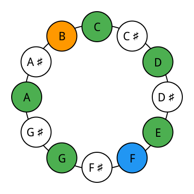
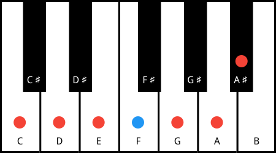

# music-db

Music Database is an attempt to make an encyclopedic database of scales based
on [William Zeitler](https://allthescales.org) classification.

This project consists of:

- postgres database seed generator
- music theory data API

The project is bundled as a docker cluster containing

- postgres 16 database prefilled with music data
- HTTP REST API server

Features:

- 12 semitones per octave
- Supports 1490 scales
- Supports 17880 keys
- Supports 936 chords
- Keys mode detection
- Scale balance detection and center of gravity
- Scale perfections and imperfections detection
- List chords of a note of a given key
- List keys that are applicable to that chord
- Scale rotational symmetry detection
- Scale reflective symmetry detection
- Scale cardinality
- Chord cardinality
- Ian Ring's numbering system for pitches, chords and scales
- Scale and key illustration as pitch class bracelet diagram
- Scale and key illustration as circle of fifth bracelet diagram
- Scale, key and chord and illustration using keyboard

## Running test

```shell
make test
```

## Building

To get database up and running

```shell
docker-compose up
```

Navigate to http://localhost:3000/api/docs/ to see swagger docs

## Example Queries

### Listing Pitches of a key

```postgresql
SELECT k.name AS key,
       p.name AS pitch,
       kp.pitch_id
FROM key_pitches kp
         JOIN keys k ON kp.key_id = k.id
         JOIN pitches p ON kp.pitch_id = p.id
WHERE k.name = 'CNaturalIonian'
ORDER BY kp.id;
```

### List All Chords for C Major

```postgresql
SELECT k.name AS key,
       p.name AS pitch,
       c.name AS chord
FROM key_pitch_chords spc
         JOIN keys k ON spc.key_id = k.id
         JOIN chords c ON spc.chord_id = c.id
         JOIN pitches p ON spc.pitch_id = p.id
WHERE k.name = 'CNaturalIonian';
```

## Query by API

### Listing Pitches

```shell
$ curl localhost:3000/api/v1/theory/pitches
[{"id":1,"name":"CNatural"},{"id":2,"name":"CSharp"},{"id":3,"name":"DNatural"},{"id":4,"name":"DSharp"},{"id":5,"name":"ENatural"},{"id":6,"name":"FNatural"},{"id":7,"name":"FSharp"},{"id":8,"name":"GNatural"},{"id":9,"name":"GSharp"},{"id":10,"name":"ANatural"},{"id":11,"name":"ASharp"},{"id":12,"name":"BNatural"}]
```

## Query by API

API is accessible at port 3000

Pagination via query string `page` and `per_page`

### Pitches

| Method | Path                                  | Description            |
|--------|---------------------------------------|------------------------|
| GET    | `/api/v1/theory/pitches/{:id}/chords` | List chords from pitch |
| GET    | `/api/v1/theory/pitches/{:id}/keys`   | List keys from pitch   |
| GET    | `/api/v1/theory/pitches/{:id}/scales` | List scales from pitch |
| GET    | `/api/v1/theory/pitches/{:id}`        | Get pitch              |
| GET    | `/api/v1/theory/pitches`              | List pitches           |

### Chords

| Method | Path                                  | Description        |
|--------|---------------------------------------|--------------------|
| GET    | `/api/v1/theory/chords/{:id}/keys`    | List chord keys    |
| GET    | `/api/v1/theory/chords/{:id}/pitches` | List chord pitches |
| GET    | `/api/v1/theory/chords/{:id}/quality` | Get chord quality  |
| GET    | `/api/v1/theory/chords/{:id}/scales`  | List chord scales  |
| GET    | `/api/v1/theory/chords/{:id}`         | Get chord          |
| GET    | `/api/v1/theory/chords`               | List chords        |

### Scales

| Method | Path                                                                 | Description                                                |
|--------|----------------------------------------------------------------------|------------------------------------------------------------|
| GET    | `/api/v1/theory/scales/{:id}/chords`                                 | List scale chords                                          |
| GET    | `/api/v1/theory/scales/{:id}/keys`                                   | List scale keys                                            |
| GET    | `/api/v1/theory/scales/{:id}/pitches`                                | List scale pitches                                         |
| GET    | `/api/v1/theory/scales/{:id}`                                        | Get scale detail                                           |
| GET    | `/api/v1/theory/scales`                                              | List scales                                                |
| GET    | `/api/v1/theory/scales/{:id}/illustrations/pitch_class_bracelet`     | Illustrate the scale as a pitch class bracelet diagram     |
| GET    | `/api/v1/theory/scales/{:id}/illustrations/circle_of_fifth_bracelet` | Illustrate the scale as a circle of fifth bracelet diagram |

### Keys

| Method | Path                                                               | Description                                              |
|--------|--------------------------------------------------------------------|----------------------------------------------------------|
| GET    | `/api/v1/theory/keys/{:id}/chords`                                 | List key chords                                          |
| GET    | `/api/v1/theory/keys/{:id}/modes`                                  | List key modes                                           |
| GET    | `/api/v1/theory/keys/{:id}/pitches`                                | List key pitches                                         |
| GET    | `/api/v1/theory/keys/{:id}`                                        | Get key detail                                           |
| GET    | `/api/v1/theory/keys`                                              | List keys                                                |
| GET    | `/api/v1/theory/keys/{:id}/illustrations/pitch_class_bracelet`     | Illustrate the key as a pitch class bracelet diagram     |
| GET    | `/api/v1/theory/keys/{:id}/illustrations/circle_of_fifth_bracelet` | Illustrate the key as a circle of fifth bracelet diagram |

## Bracelet Diagram

### Pitch Class Bracelet Diagram

C Natural Ionian illustrated as pitch class bracelet diagram



### Circle Of Fifth Bracelet Diagram

C Natural Ionian illustrated as circle of fifth bracelet diagram


## Keyboard

FNaturalIonian illustrated using keyboard


